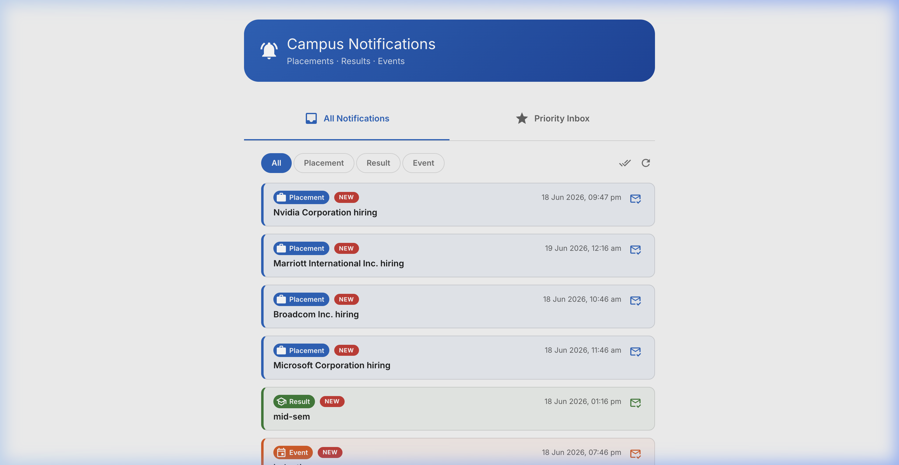
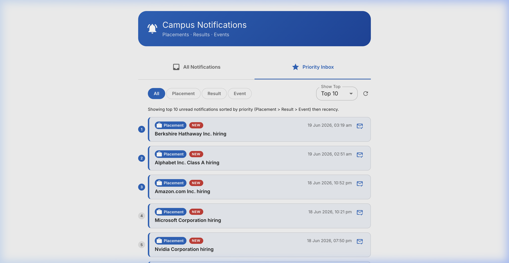
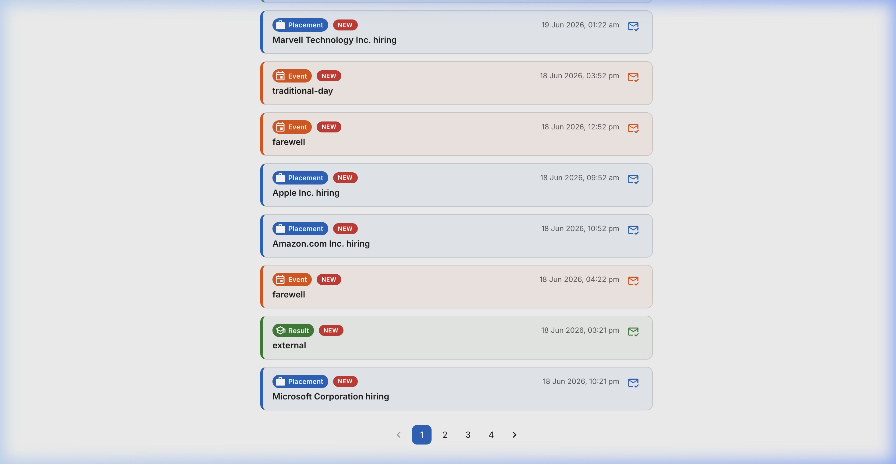
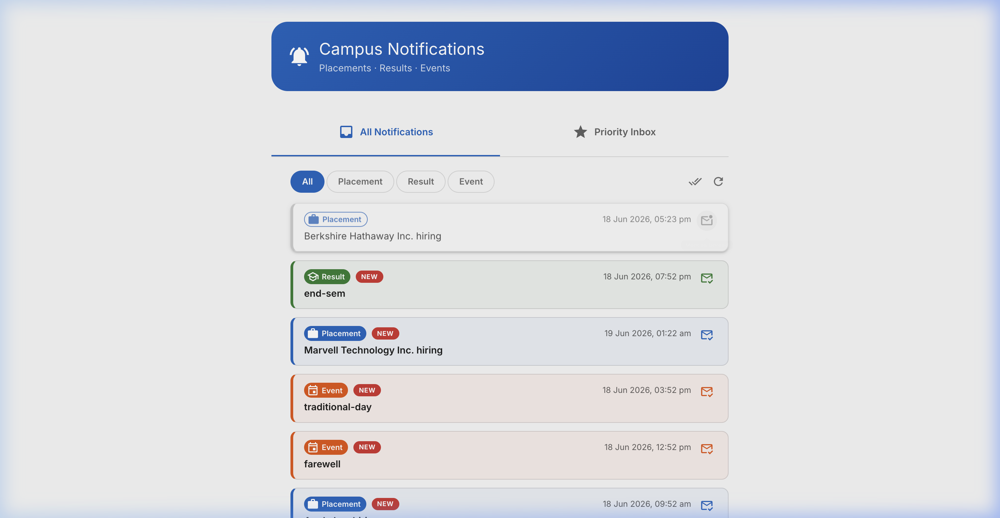
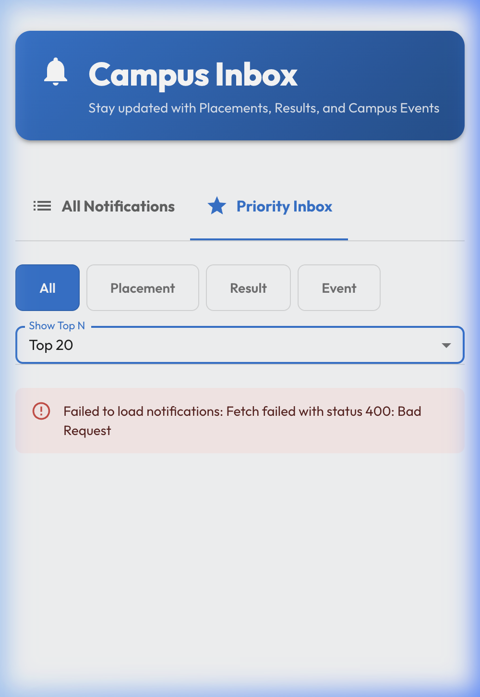

# Campus Notifications Microservice

**Student:** SAGAR M  
**Roll No:** ENG23DS0029  
**Repository:** [ENG23DS0029](https://github.com/Sagarverse/ENG23DS0029)

---

## Stage 1 – Priority Inbox (Backend Logic)

A standalone Python script (`priority_inbox.py`) that fetches notifications from the evaluation API, computes priority based on **type weight** (Placement > Result > Event) and **recency**, and outputs the **top 10 priority notifications**.

### How to Run

```bash
python3 priority_inbox.py
```

### Priority Output Screenshot



### System Design

See [Notification_System_Design.md](notification-system-design.md) for the full explanation of:
- Priority computation formula (weight × scale + epoch timestamp)
- Continuous ingestion handling
- Min-Heap based efficient top-N maintenance (O(M log n))

---

## Stage 2 – Frontend Integration (React + Material UI)

A React application inside `notification-app-fe/` that runs on **http://localhost:3000**.

### Features

- **All Notifications Page** – Paginated view of all notifications fetched from the API
- **Priority Inbox Page** – Top N (10/15/20, user-configurable) unread notifications sorted by weight + recency
- **Type Filtering** – Filter by Placement, Result, or Event on both pages
- **Read/Unread Tracking** – Client-side localStorage-based tracking with visual indicators (NEW badge, color-coded borders)
- **Logging Middleware** – Integrated across API calls and state changes, posting logs to the evaluation service
- **Responsive Design** – Works on both desktop and mobile viewports
- **Material UI** – All styling uses `@mui/material` components

### How to Run

```bash
cd notification-app-fe
npm install
npm run dev
# Opens at http://localhost:3000
```

### Screenshots

#### Desktop – All Notifications


#### Desktop – Priority Inbox


#### Read/Unread Toggle


#### After Marking as Read


#### Mobile – Priority Inbox


---

## Project Structure

```
├── priority_inbox.py                  # Stage 1: standalone priority script
├── priority_notifications_output.json # Stage 1: JSON output
├── notification-system-design.md      # System design document
├── notification-app-fe/               # Stage 2: React frontend
│   ├── src/
│   │   ├── api/
│   │   │   ├── config.js             # Auth token management
│   │   │   ├── logging.js            # Logging middleware
│   │   │   └── notifications.js      # Notification API client
│   │   ├── components/
│   │   │   ├── NotificationCard.jsx   # Notification card component
│   │   │   └── NotificationFilter.jsx # Type filter toggle
│   │   ├── hooks/
│   │   │   └── useNotifications.js    # Data fetching + read/unread hooks
│   │   ├── pages/
│   │   │   ├── AllNotificationsPage.jsx
│   │   │   ├── PriorityInboxPage.jsx
│   │   │   └── NotificationsPage.jsx  # Main shell with tabs
│   │   ├── App.jsx
│   │   ├── main.jsx
│   │   └── index.css
│   ├── vite.config.js
│   └── package.json
├── logging-middleware/
└── screenshots/
```

---

## Tech Stack

- **Frontend:** React 19, Material UI 9, Vite 8
- **Backend Logic:** Python 3 (stdlib only)
- **API:** Campus Evaluation Service (`http://4.224.186.213/evaluation-service/`)
